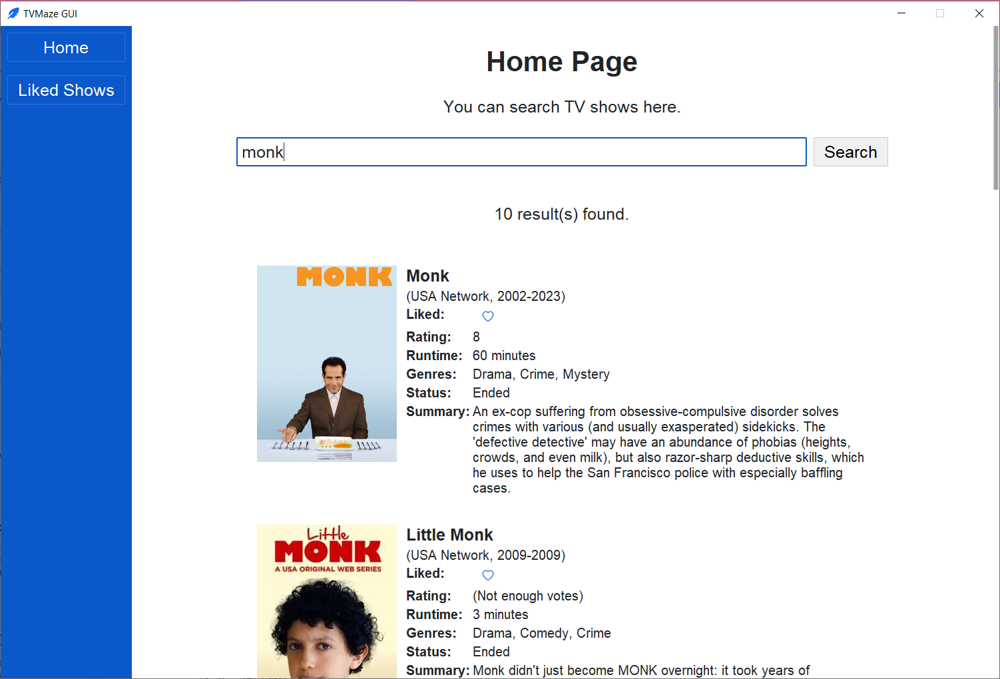
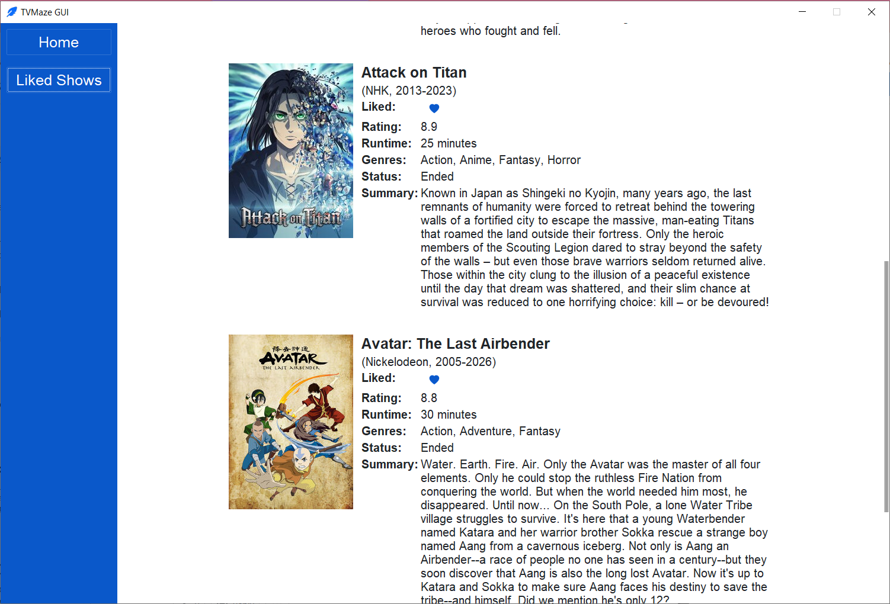

# TVMaze GUI

A lightweight app made with Python Tkinter (ttkbootstrap) that lets you search for TV series using the TVmaze API and save your favorite shows locally.

## Environment

Python version:

```
Python 3.13.15
```

Libraries used:

```
ttkbootstrap        2.2.3
requests            2.34.2
pillow              12.3.0
beautifulsoup4      4.15.0
```

## Screenshots

### Screenshot 1



### Screenshot 2


### Screenshot 3


